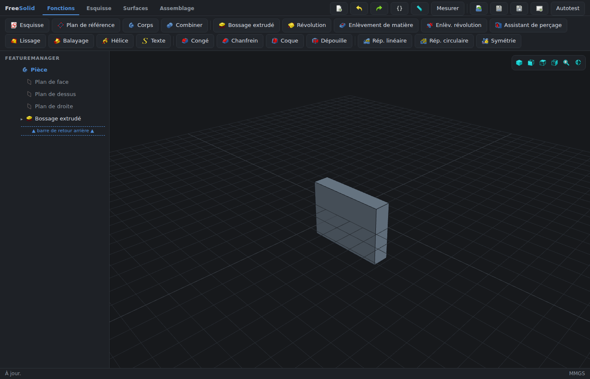

# FreeSolid

Interface de CAO mécanique moderne sur un moteur FreeCAD headless intact — les fichiers restent des `.FCStd`
standard, ouvrables dans FreeCAD.



## Démarrage

Prérequis : FreeCAD ≥ 1.0 (`freecadcmd` dans le `PATH`, ou via micromamba /
AppImage).

```bash
freecadcmd engine/server.py
# puis ouvrir http://localhost:8787
```

Un seul processus sert l'API JSON et l'UI statique (`app/`).

## Ce qui marche aujourd'hui

- **Esquisse** contrainte + solveur WASM (planegcs) à ~60 fps pendant le
  drag ; décalage d'entités, symétrie, répétition, congé, ajustement
- **PartDesign** : bossage/enlèvement, révolution, congé, chanfrein, coque,
  dépouille, perçage, lissage, balayage, hélice, répétitions
- **Multi-corps** et couleurs d'affichage par corps
- **Assemblage** : composants, joints, solveur MbD, interférences
- **Surfacique** : extrusion/révolution de profils ouverts, lissage,
  épaissir — **paramétrique et rééditable** (double-clic, expressions) ;
  coudre reste figé
- **Équations** et expressions (variables globales, cotes pilotées)
- **Import/export** STEP, STL, 3MF ; sauvegarde/ouverture `.FCStd`
- **Mise en plan** DXF cotée (vues Face / Dessus / Iso), coupe X/Y/Z
  optionnelle
- **Image d'esquisse** (calque de fond)

## Architecture

Trois couches :

1. `app/` — navigateur (Three.js, FeatureManager, panneaux)
2. `engine/` — HTTP JSON sur `127.0.0.1:8787` (stdlib Python)
3. FreeCAD headless (`freecadcmd`) — géométrie, historique, STEP

Détail : [`docs/architecture-app.md`](docs/architecture-app.md).

## Développement

```bash
python3 -m pip install pytest
python3 -m compileall -q engine
python3 -m pytest -q

node --test tests/js/*.test.mjs

PYTHONIOENCODING=utf-8 freecadcmd scripts/run-selftest.py
# smoke navigateur (FreeCAD + Chromium) : scripts/smoke/
```

## Licences

LGPL-2.1-or-later, comme FreeCAD.

Composants vendorés :

- solveur d'esquisse WASM — [`app/vendor/planegcs/README.md`](app/vendor/planegcs/README.md)
- icônes FreeCAD — [`app/icons/README.md`](app/icons/README.md)
